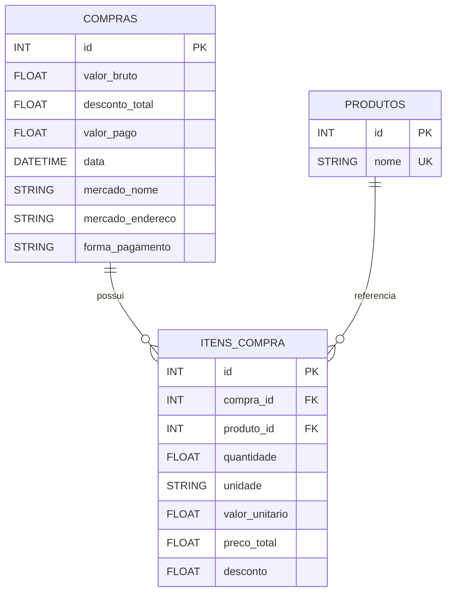

# Estrutura atual do banco de dados (NFC-e API)

## 1) Resumo tecnico
- Banco: SQLite
- Arquivo: `nfce_api/market.db`
- URL de conexao na aplicacao: `sqlite:///./market.db`
- ORM: SQLAlchemy (declarative base)
- Criacao de tabelas: `Base.metadata.create_all(bind=engine)` em `main.py`

## 2) Diagrama ER (visao geral)

## 3) DDL atual (extraida de `market.db`)
'''sql
CREATE TABLE compras (
        id INTEGER NOT NULL,
        valor_bruto FLOAT,
        desconto_total FLOAT,
        valor_pago FLOAT,
        data DATETIME,
        mercado_nome VARCHAR,
        mercado_endereco VARCHAR,
        forma_pagamento VARCHAR,
        PRIMARY KEY (id)
);

CREATE TABLE produtos (
        id INTEGER NOT NULL,
        nome VARCHAR,
        PRIMARY KEY (id),
        UNIQUE (nome)
);

CREATE TABLE itens_compra (
        id INTEGER NOT NULL,
        compra_id INTEGER,
        produto_id INTEGER,
        quantidade FLOAT,
        unidade VARCHAR,
        valor_unitario FLOAT,
        preco_total FLOAT,
        desconto FLOAT,
        PRIMARY KEY (id),
        FOREIGN KEY(compra_id) REFERENCES compras (id),
        FOREIGN KEY(produto_id) REFERENCES produtos (id)
);
'''

## 4) Dicionario de dados

### Tabela: `compras`
| Coluna | Tipo (SQLite) | Chave | Nulo? | Observacao |
|---|---|---|---|---|
| id | INTEGER | PK | Nao | Identificador da compra |
| valor_bruto | FLOAT | - | Sim | Total sem desconto |
| desconto_total | FLOAT | - | Sim | Soma dos descontos |
| valor_pago | FLOAT | - | Sim | Total final pago |
| data | DATETIME | - | Sim | Data/hora da compra |
| mercado_nome | VARCHAR | - | Sim | Nome do mercado |
| mercado_endereco | VARCHAR | - | Sim | Endereco do mercado |
| forma_pagamento | VARCHAR | - | Sim | Forma de pagamento |

### Tabela: `produtos`
| Coluna | Tipo (SQLite) | Chave | Nulo? | Observacao |
|---|---|---|---|---|
| id | INTEGER | PK | Nao | Identificador do produto |
| nome | VARCHAR | UNIQUE | Sim | Nome unico do produto |

Indices:
- `sqlite_autoindex_produtos_1` (indice automatico do `UNIQUE(nome)`)

### Tabela: `itens_compra`
| Coluna | Tipo (SQLite) | Chave | Nulo? | Observacao |
|---|---|---|---|---|
| id | INTEGER | PK | Nao | Identificador do item |
| compra_id | INTEGER | FK -> compras.id | Sim | Compra de origem |
| produto_id | INTEGER | FK -> produtos.id | Sim | Produto referenciado |
| quantidade | FLOAT | - | Sim | Quantidade do item |
| unidade | VARCHAR | - | Sim | Unidade (UN, KG, LT, etc.) |
| valor_unitario | FLOAT | - | Sim | Preco por unidade |
| preco_total | FLOAT | - | Sim | Total do item |
| desconto | FLOAT | - | Sim | Desconto do item |

## 5) Relacionamentos
- `compras (1) -> (N) itens_compra` via `itens_compra.compra_id`
- `produtos (1) -> (N) itens_compra` via `itens_compra.produto_id`

## 6) Regras de negocio observadas na persistencia (`nfce_service.py`)
- Nao permite salvar compra sem itens.
- `valor_bruto`, `desconto_total` e `valor_pago` podem vir de `totals`; se ausentes, sao calculados a partir dos itens.
- Produto e deduplicado por `nome`; se nao existir, e criado.
- Defaults aplicados ao item quando faltam campos:
  - `quantidade = 1.0`
  - `unidade = "UN"`
  - `valor_unitario = unit_price` ou `price`
  - `preco_total = final_price` ou `valor_unitario * quantidade`
  - `desconto = 0.0`

## 7) Observacoes para uso por IA
- Nao ha tabela de usuarios, fornecedores, categorias ou historico de preco nesta estrutura atual.
- Nao ha migracoes versionadas; o schema e criado/atualizado pelo SQLAlchemy no startup.
- A consulta de gastos mensais agrega por `strftime('%Y-%m', compras.data)`.
- Tipos numericos estao em `FLOAT`; para cenarios financeiros criticos, considerar migracao futura para tipo decimal (com validacao apropriada no backend).

## 8) Fontes de verdade deste documento
- `nfce_api/models.py`
- `nfce_api/database.py`
- `nfce_api/nfce_service.py`
- `nfce_api/main.py`
- Schema real extraido de `nfce_api/market.db`
